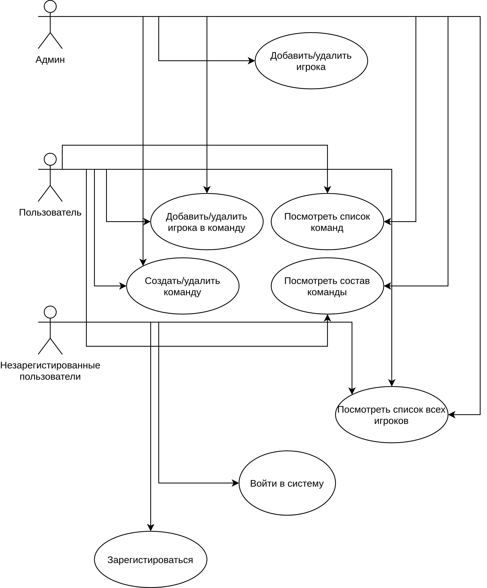
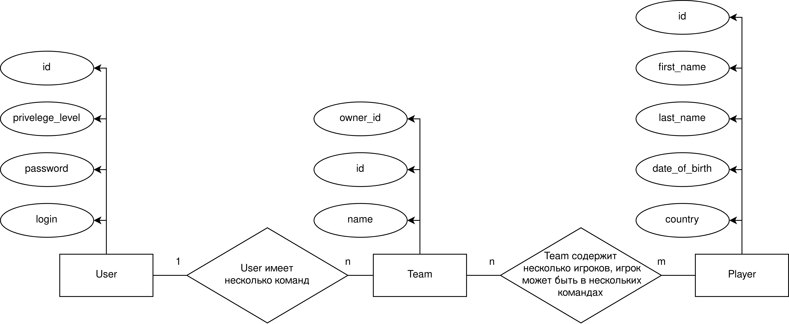
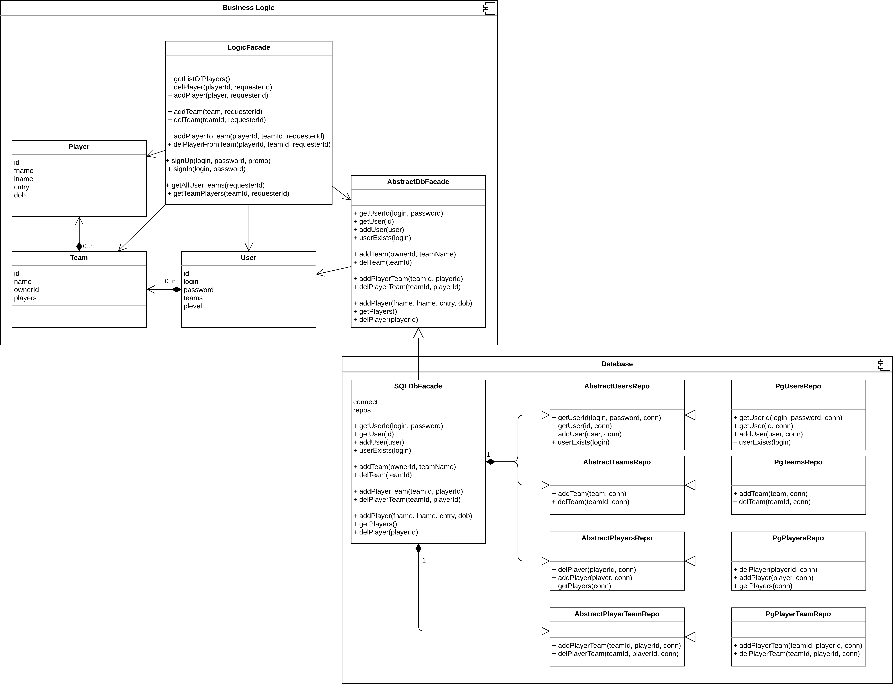

# Программа для сборки составов хоккейных игроков

Примечание: данный проект не является моей курсовой работой, я делаю его отдельно для предмета ППО

### 1. Use-Case

### 2. ER-диаграмма

### 3. Тип приложения и технологический стек

Данное приложение представляет из себя Web SPA приложение.

Технологический стек:
* **NodeJS (Express)** --- бэкенд;
* **Vanilla HTML/CSS/JS** - фронтенд;
* **Mocha** --- фреймворк для тестирования;
* **Postgres** --- СУБД.

### 4. UML-диаграммы для компонентов из курсового проекта

